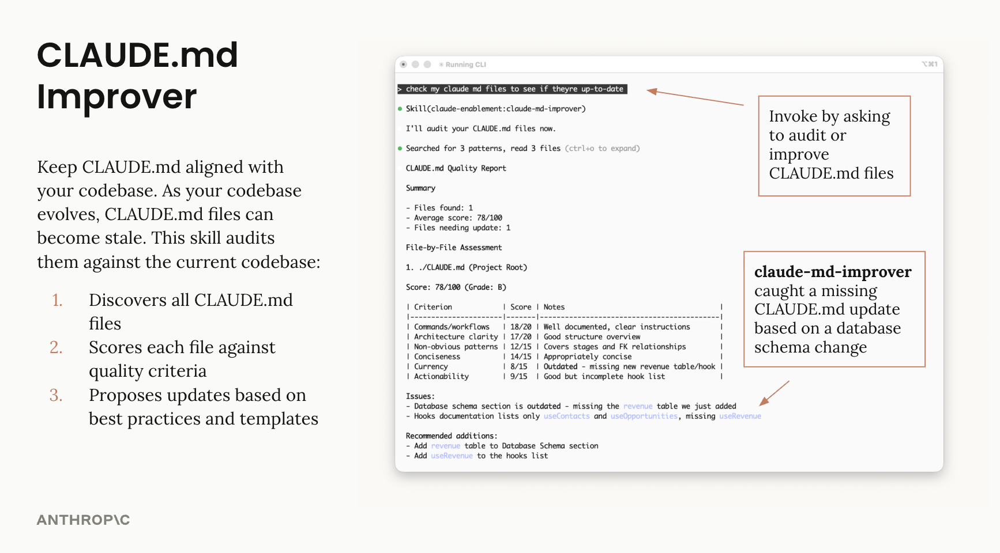
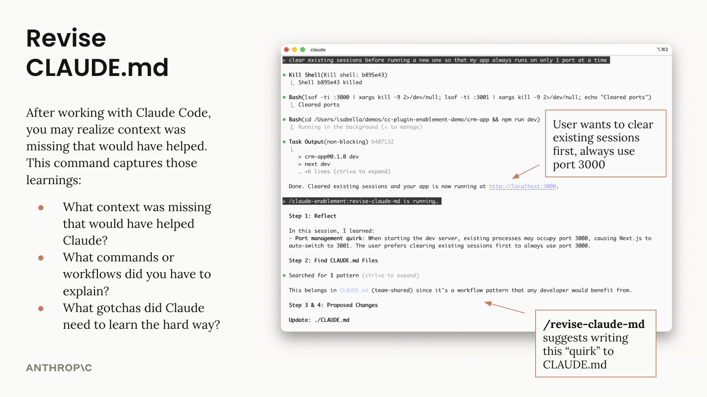

# CODEAGENT.md Management Plugin

Tools to maintain and improve CODEAGENT.md files - audit quality, capture session learnings, and keep project memory current.

## What It Does

Two complementary tools for different purposes:

| | claude-md-improver (skill) | /revise-claude-md (command) |
|---|---|---|
| **Purpose** | Keep CODEAGENT.md aligned with codebase | Capture session learnings |
| **Triggered by** | Codebase changes | End of session |
| **Use when** | Periodic maintenance | Session revealed missing context |

## Usage

### Skill: claude-md-improver

Audits CODEAGENT.md files against current codebase state:

```
"audit my CODEAGENT.md files"
"check if my CODEAGENT.md is up to date"
```



### Command: /revise-claude-md

Captures learnings from the current session:

```
/revise-claude-md
```



## Author

Isabella He (isabella@anthropic.com)
